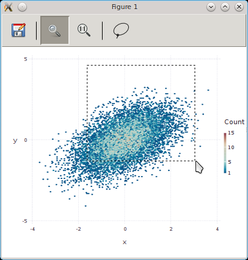
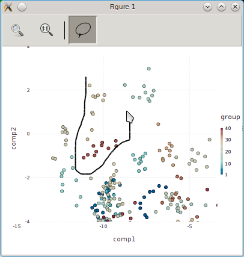
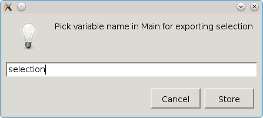

# Immerse

[](https://travis-ci.org/JuliaGraphics/Immerse.jl)

Immerse is a wrapper that adds graphical interactivity to Julia plots.
Currently, Immerse supports
[Gadfly](https://github.com/dcjones/Gadfly.jl).

# Usage

By and large, you plot just as you would in Gadfly:

```jl
using Immerse, Distributions
X = rand(MultivariateNormal([0.0, 0.0], [1.0 0.5; 0.5 1.0]), 10000)
plot(x=X[1,:], y=X[2,:], Geom.hexbin)
```
However, rather than being displayed in a browser window, you'll see your figure in a Gtk window:



The toolbar at the top supports saving your figure to a file, zooming and panning, and lasso selection.

Zooming and panning uses the defaults set by [GtkUtilities](https://github.com/timholy/GtkUtilities.jl).  The left mouse button allows you to rubberband-select a zoom region.  Use your mouse wheel or arrow-keys to pan or change the zoom level.  Double-click, or press the 1:1 button, to restore the full view.

## Lasso selection

The right-most button on the toolbar allows you to select a group of points for further analysis by drawing a "lasso" around them:



By default, this pops up a dialog asking you which variable in `Main` you want to save the selected indexes to:



You can alternatively define a custom callback function; see the help for `lasso_initialize` by typing `?lasso_initialize` at the REPL.

## Hit testing

You can add extra interactivity by setting up callbacks that run whenever the user clicks on an object. A demonstration of this capability is exhibited in the `test/hittesting.jl` test script:


Here the red circles are drawn around the dots that the user clicked on; see also the console output that showed the results of clicking on the line segments between the dots.

Note that hit testing is disabled while the "zoom" button is active.

## Setting and getting properties

Objects can be modified interactively after their creation:

```jl
julia> using Immerse, Colors

julia> hfig = figure()
1

julia> x = linspace(0,4pi,101);

julia> p = plot(x=x, y=sin(x), Geom.line(tag=:line))

julia> setproperty!((hfig,:line), rand(1:5), :linewidth)
3

julia> setproperty!((hfig,:line), RGB(rand(),rand(),rand()), :stroke)
RGB{Float64}(0.9563599683564541,0.20964995278692222,0.997388106654052)

julia> setproperty!((hfig,:line), false, :visible)
false

julia> setproperty!((hfig,:line), true, :visible)
true

julia> getproperty((hfig,:line), :visible)
1-element Array{Bool,1}:
 true
```
Compose `Form` and `Property` objects apply to a vector of objects, which is why `getproperty` returns a vector.


## Figure windows

Each figure is addressed by an integer; for a window displaying a
single Gadfly figure, by default this integer appears in the window
title.

There are a few simple utilities for working with figure windows:

- `figure()` opens a new figure window. This will become the default
plotting window.
- `figure(3)` raises the corresponding window and makes it the default.
- `gcf()` returns the index of the current default figure.
- `scf()` shows the current figure (raising the window to the top).
- `closefig(3)` destroys Figure 3, closing the window.
- `closeall()` closes all open figure windows.


## Issues

#### When I type `scf()`, nothing happens

Your window manager may have "focus stealing prevention" enabled. For
example, under KDE, go to the Kmenu->System Settings->Window
behavior->Window behavior (pane)->Focus (tab) and set "Focus stealing
prevent" to "None".  Alternatively, if you want to limit this change
to julia, use the "Window rules" pane and add a new setting where
"Window class (application)" is set to "Regular Expression" with value
"^julia.*".
