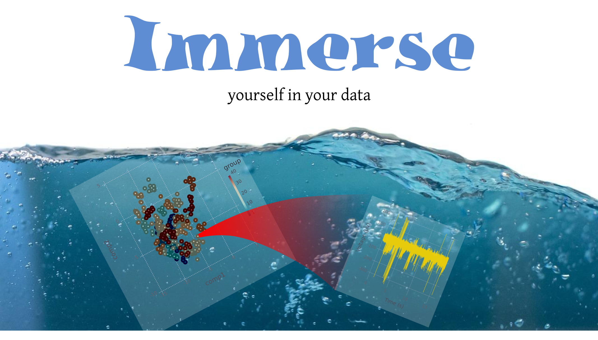

# Immerse

[](https://travis-ci.org/JuliaGraphics/Immerse.jl)

Immerse is a wrapper that adds graphical interactivity to Julia plots.
Currently, Immerse supports
[Gadfly](https://github.com/dcjones/Gadfly.jl).  Existing or
in-progress features include pan/zoom, hit-testing, and multi-point
selection.  Documentation is currently a work-in-progress.

# Usage

By and large, you plot just as you would in Gadfly:

```jl
using Immerse, Distributions
X = rand(MultivariateNormal([0.0, 0.0], [1.0 0.5; 0.5 1.0]), 10000)
plot(x=X[1,:], y=X[2,:], Geom.hexbin)
```
However, rather than being displayed in a browser window, the display occurs in a Gtk window:


The toolbar at the top permits zooming and panning, using the defaults set by [GtkUtilities](https://github.com/timholy/GtkUtilities.jl).

## Figure windows

Each figure is addressed by an integer; for a window displaying a
single Gadfly figure, by default this integer appears in the window
title.

There are a few simple utilities for working with figure windows:

- `figure()` opens a new figure window. This will become the default
plotting window.
- `figure(3)` raises the corresponding window and makes it the default.
- `gcf()` returns the index of the current default figure.
- `closefig(3)` destroys Figure 3, closing the window.
- `closeall()` closes all open figure windows.
